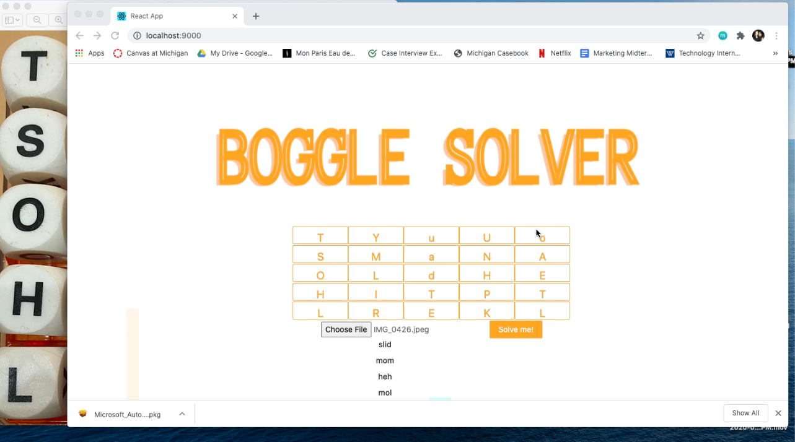

## Boggle Solver Application
An application that solves the Boggle word-finding game by taking in a picture of a Boggle Board and returning a list of word solutions. 

## Motivation
When looking up Boggle Solver websites, users had to manually enter each letter of the Boggle Board online, which was extremely time-consuming. To optimize the process, I created an application where users can take a picture of their Boggle Board and upload it to the application. 

## Technologies Used
Built with Java, React, Ant Design, JavaScript, and Swagger Open API. 

## How it Works

I created a Boggle Solver webpage, where users can click the "Choose file" button to upload an image of their Boggle Board. Once, they upload an image of their Boggle Boad, the board on the site (as seen in the picture above) will change to look like the image uploaded. If there are "null" characters, the user can manually add those letters in, otherwise, the user can hit the "Solve me" button to view a list of word solutions! 

[Link to Demo Video](https://www.youtube.com/watch?v=w0mSC-j7yPo&feature=youtu.be)
